# Database

This folder contains the SQL scripts and data for the portfolio website database. It is organized into two main parts:

- **Schema** – SQL scripts to create all database tables.
- **Seeds** – SQL scripts to populate tables with initial data.

> Note: The `contact` table is included in the schema but does not have seed data, as the initial dataset is insufficient.

---

## Tables Overview

The database has **20 tables**:

1. `pages` – Stores website pages metadata.  
2. `meta` – Stores SEO and social metadata per page.  
3. `navigation` – Stores main site navigation items.
4. `about_me` - Stores About Me section metadata.
5. `about_me_images` - Stores multiple image versions for About Me section.
6. `about_me_text` - Stores About Me text paragraphs.
7. `quotes` - Stores inspirational quotes.
8. `page_section_content` - Stores text content for page sections (paragraphs only).
9. `cert_desc` – Stores descriptive data for certifications displayed on the website.  
10. `certificate_categories` – Stores certificate categories linked to pages via foreign key.  
11. `certificates` – Stores individual certificates linked to descriptions.  
12. `certificate_category_map` – Maps certificates to their categories (many-to-many).  
13. `ita_certificate` – Certificates obtained from ITAcademy.  
14. `ita_certificate_images` – Multiple image versions for ITAcademy certificates.  
15. `skills` – Stores technical and professional skills used in the portfolio.  
16. `services` – Stores website services data.  
17. `contact` – Stores contact form submissions.  
18. `support` – Stores external support / donation links.  
19. `project_categories` – Stores project categories used to group projects.  
20. `projects` – Stores all projects including websites, Photoshop works, logos, and illustrations.  
21. `project_websites` – Stores website-specific details for projects of category "website".  
22. `website_types` – Stores types or categories of websites (e.g., Fullstack, Mini Apps, WordPress).  
23. `project_website_types` – Many-to-many relationship linking projects to website types.  
24. `project_photoshop` – Stores Photoshop project images at multiple resolutions.  
25. `project_images` – Stores images for general projects such as logos and illustrations.  

---

## ER Diagram

The following ER diagram shows the relationships between all tables:

```mermaid
erDiagram
    PAGES {
        INT page_id PK
        VARCHAR title
        VARCHAR slug
        TIMESTAMP created_at
    }

    META {
        INT meta_id PK
        INT page_id FK
        VARCHAR meta_title
        VARCHAR meta_description
        VARCHAR meta_keywords
    }

    NAVIGATION {
        INT nav_id PK
        INT page_id FK
        VARCHAR title
        VARCHAR link
        INT sort_order
    }

    ABOUT_ME {
        INT about_id PK
        INT page_id FK
        VARCHAR heading
        INT sort_order
    }

    ABOUT_ME_IMAGES {
        INT image_id PK
        INT about_id FK
        VARCHAR size_label
        VARCHAR file_path
        VARCHAR alt
        INT sort_order
    }

    ABOUT_ME_TEXT {
        INT text_id PK
        INT about_id FK
        TEXT content
        INT sort_order
    }

    QUOTES {
        INT quote_id PK
        INT page_id FK
        VARCHAR quote_text
        VARCHAR author
        INT sort_order
    }

    PAGE_SECTION_CONTENT {
        INT content_id PK
        INT page_id FK
        VARCHAR section
        VARCHAR block
        TEXT content
        INT position
    }

    CERT_DESC {
        INT cert_desc_id PK
        VARCHAR title
        TEXT description
    }

    CERTIFICATE_CATEGORIES {
        INT category_id PK
        VARCHAR name
        INT page_id FK
    }

    CERTIFICATES {
        INT certificate_id PK
        INT cert_desc_id FK
        VARCHAR title
        VARCHAR issuer
        DATE issued_date
    }

    CERTIFICATE_CATEGORY_MAP {
        INT certificate_id PK
        INT category_id PK
    }

    ITA_CERTIFICATE {
        INT ita_cert_id PK
        INT certificate_id FK
        VARCHAR certificate_number
        DATE completion_date
    }

    ITA_CERTIFICATE_IMAGES {
        INT image_id PK
        INT ita_cert_id FK
        VARCHAR image_path
    }

    SKILLS {
        INT skill_id PK
        INT page_id FK
        VARCHAR name
        VARCHAR type
    }

    SERVICES {
        INT service_id PK
        INT page_id FK
        VARCHAR title
        TEXT description
    }

    CONTACT {
        INT contact_id PK
        INT page_id FK
        VARCHAR name
        VARCHAR email
        TEXT message
        TIMESTAMP submitted_at
    }

    SUPPORT {
        INT support_id PK
        INT page_id FK
        VARCHAR name
        VARCHAR link
    }

    PROJECT_CATEGORIES {
        INT category_id PK
        VARCHAR name
    }

    PROJECTS {
        INT project_id PK
        INT category_id FK
        INT page_id FK
        VARCHAR title
        VARCHAR summary
    }

    PROJECT_WEBSITES {
        INT project_id PK
        VARCHAR role
        VARCHAR skills
        VARCHAR features
        VARCHAR link
        VARCHAR github
        VARCHAR img_1100
        VARCHAR img_1100_2x
        VARCHAR img_768
        VARCHAR img_768_2x
        VARCHAR img_375
        VARCHAR img_375_2x
        VARCHAR img
    }

    WEBSITE_TYPES {
        INT website_type_id PK
        VARCHAR name
        VARCHAR slug
    }

    PROJECT_WEBSITE_TYPES {
        INT project_id PK
        INT website_type_id PK
    }

    PROJECT_PHOTOSHOP {
        INT project_id PK
        VARCHAR big_img
        VARCHAR img_576
        VARCHAR img_530
        VARCHAR img_500
        VARCHAR img_450
        VARCHAR img_408
        VARCHAR img_350
        VARCHAR img_282
        VARCHAR img
    }

    PROJECT_IMAGES {
        INT project_id PK
        VARCHAR image
    }

    %% Relationships
    PAGES ||--o{ META : has
    PAGES ||--o{ NAVIGATION : has
    PAGES ||--o{ ABOUT_ME : has
    ABOUT_ME ||--o{ ABOUT_ME_IMAGES : contains
    ABOUT_ME ||--o{ ABOUT_ME_TEXT : contains
    PAGES ||--o{ QUOTES : displays
    PAGES ||--o{ PAGE_SECTION_CONTENT : contains

    PAGES ||--o{ PROJECTS : displays
    PAGES ||--o{ SKILLS : has
    PAGES ||--o{ SERVICES : has
    PAGES ||--o{ CONTACT : receives
    PAGES ||--o{ SUPPORT : has

    CERT_DESC ||--o{ CERTIFICATES : defines
    CERTIFICATES ||--o{ ITA_CERTIFICATE : linked_to
    ITA_CERTIFICATE ||--o{ ITA_CERTIFICATE_IMAGES : has
    CERTIFICATES ||--o{ CERTIFICATE_CATEGORY_MAP : categorized
    CERTIFICATE_CATEGORIES ||--o{ CERTIFICATE_CATEGORY_MAP : maps

    PROJECT_CATEGORIES ||--o{ PROJECTS : categorizes
    PROJECTS ||--o{ PROJECT_WEBSITES : website_details
    PROJECTS ||--o{ PROJECT_PHOTOSHOP : photoshop_details
    PROJECTS ||--o{ PROJECT_IMAGES : images
    PROJECT_WEBSITES ||--o{ PROJECT_WEBSITE_TYPES : typed_as
    WEBSITE_TYPES ||--o{ PROJECT_WEBSITE_TYPES : applied_to
```




## Usage Instructions

> It is recommended to execute schema files in numerical order to satisfy foreign key dependencies.


### Folder Structure

```text
db/
├── schema/
│   ├── 01_pages.sql
│   ├── 02_meta.sql
│   └── ...
├── seeds/
│   ├── 01_pages_seed.sql
│   ├── 02_projects_seed.sql
│   └── ...
└── README.md
```

1. Create the database (replace portfolio_db with your database name):

```sql
CREATE DATABASE portfolio_db CHARACTER SET utf8mb4 COLLATE utf8mb4_unicode_ci;
USE portfolio_db;
```

2. Run schema scripts:

```bash
mysql -u username -p portfolio_db < schema/01_pages.sql
mysql -u username -p portfolio_db < schema/02_meta.sql
# Repeat for all schema files in the correct order
```

Ensure tables are created in an order that satisfies foreign key dependencies.

- pages → meta → navigation
- project_categories → projects → project_websites, project_photoshop, project_images

3. Run seed scripts:

```bash
mysql -u username -p portfolio_db < seeds/01_pages_seed.sql
mysql -u username -p portfolio_db < seeds/02_projects_seed.sql
# Repeat for other seed files
```

---

### 🧑‍💻 Author

**Mirnes Glamočić** - Full-stack web developer & designer

Portfolio: [mirnesglamocic.com](https://mirnesglamocic.com "Visit my portfolio website")

**Email:** contact@mirnesglamocic.com  
**LinkedIn:** https://www.linkedin.com/in/mirnesglamocic  
**GitHub:** https://github.com/full-stack-web-developer-and-designer

---

### ✅ Notes & Recommendations

Project categories (`project_categories`) are used to distinguish between websites, Photoshop projects, logos, and illustrations.

- Ensure all **image assets** referenced in `project_websites`, `project_photoshop`, and `project_images` exist in project's `assets` or `public` folder.
- All tables are created with **InnoDB** engine and **utf8mb4 charset** for full Unicode support.
- This setup allows easy extension of projects, skills, pages, and certifications.
